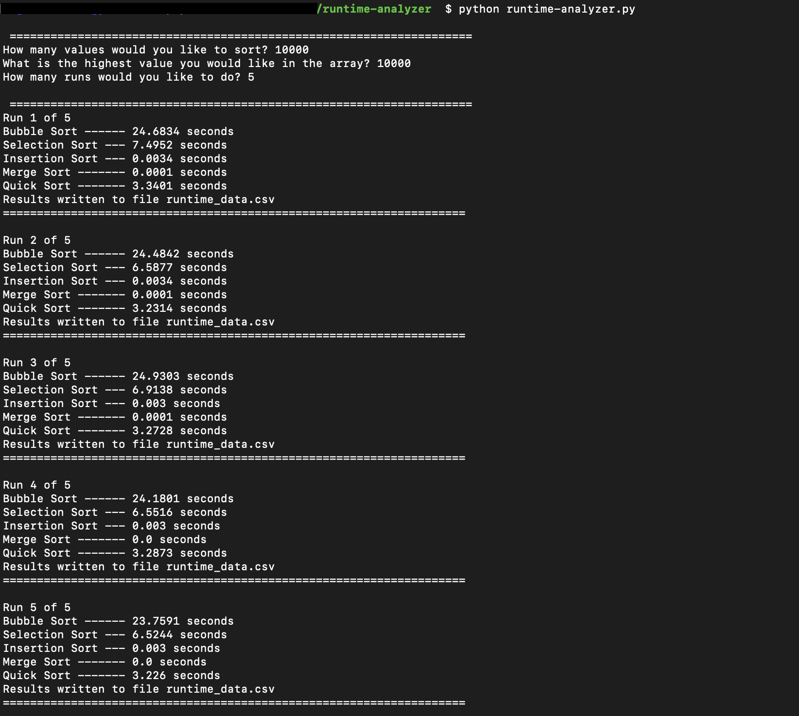

# Runtime Analyzer 

A Python project to analyze the runtime of various sorting algorithms. Uses recursion & object-oriented programming to analyze performance of the following self-implemented sorting algorithms:
* Bubble sort
* Selection sort
* Insertion sort
* Merge sort
* Quick sort

### Features:
* Generates lists of random integers according to specifications (e.g., 10 or 1 million)
* List size specified by user at runtime
  * As list size increases, inefficient sorting algorithms (O(n^2)) are dropped
* Range of integer values specified by user at runtime
* Runs sorting algorithms on generated list of integers
* Calculates and display the time it took to run the function
* Allows for multiple runs
* Writes results to file

### To Use:
In a Bash terminal, enter the following commands:

`git clone https://github.com/leeshibley/runtime-analyzer.git`

`cd runtime-analyzer`

`python runtime-analyzer.py`
